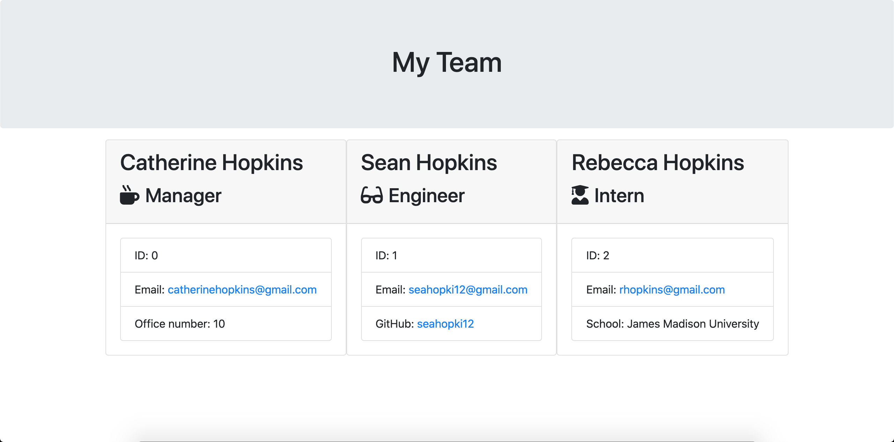

# Template Engine

## Description

The purpose of this application is to help development teams create a website that will display all necessary information for each team member including their role, email, and other relevant contact information.

## Test Instructions

* To run this application, you will need to run the following command `node app.js`.
* In order to run this command successfully, you need to make sure that you have node installed on your machine as well as 'npm' and 'inquirer'.
* Once the `node app.js` command is run, answer the following prompts and confirmations.
* Once you finish answering all the questions, you will have a team.html file generated that will display your added team members.
